Bedienungsanleitung zu Dienstplan Online
========================================

[TOC]

# Benutzerkonto

Für die Benutzung von Dienstplan Online benötigen Sie in der Regel ein
Benutzerkonto. Dieses erhalten Sie von Ihrem Administrator. Eine eigene
Registrierung als Benutzer ist nicht möglich.

Der Administrator wird
[Ihr Konto anlegen](#einen-neuen-benutzer-anlegen) , mit den nötigen
[Rechten](#benutzerrechte) ausstatten und Ihnen ein Anfangspasswort
mitteilen. Dies sollten Sie nach der ersten [Anmeldung](#anmelden)
[ändern](#passwort-ändern).

Jedes Benutzerkonto ist mit spezifischen Benutzerrechten versehen. Je
nachdem, welche Rechte Ihnen zugeteilt wurden, können Sie
unterschiedliche Felder bearbeiten oder Funktionen verwenden.

## Anmelden

Beim Aufruf der Startseite von Dienstplan Online sehen Sie zunächst eine
Anmeldeseite. Geben Sie als Benutzernamen Ihre E-Mailadresse ein. Nach
der Eingabe des Passworts klicken Sie auf "Anmelden."

## Abmelden

Um sich vom System abzumelden, klicken Sie rechts oben auf Ihren Namen
und dann auf "Abmelden".

## Passwort vergessen

Sollten Sie Ihr Passwort vergessen haben, können Sie auf der
Anmeldeseite auf "Passwort vergessen" klicken. Sie werden nach Ihrer
E-Mailadresse gefragt. Geben Sie die E-Mailadresse ein, die Sie sonst
auch für die Anmeldung verwenden. Nach einem Klick auf "Link zum
Zurücksetzen des Passworts senden" erhalten Sie unter der angegebenen
E-Mailadresse eine Nachricht mit einem Link. Klicken Sie auf den Link,
um eine Seite aufzurufen, die Ihnen die Eingabe eines neuen Passworts
erlaubt. Der Link ist nur einmalig und nur beschränkte Zeit gültig.

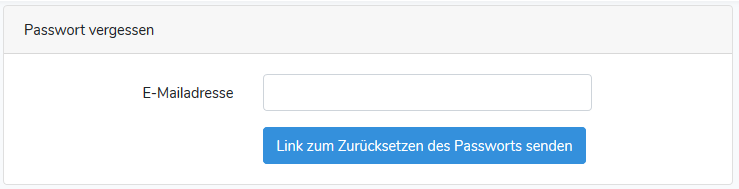

Passwörter müssen mindestens 8 Zeichen lang sein.

## Passwort ändern

Wenn Sie angemeldet sind, können Sie Ihr Passwort jederzeit ändern.
Klicken Sie dazu im Menü oben rechts auf Ihren Namen und dann auf
"Passwort ändern".

In dem folgenden Fenster geben Sie bitte Ihr bisheriges Passwort, sowie
zwei Mal das gewünschte neue Passwort ein. Klicken Sie anschließend auf
"Passwort ändern". Das neue Passwort ist sofort gültig.

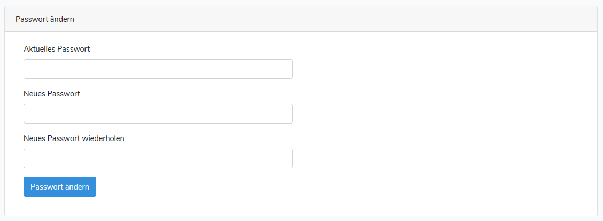

Passwörter müssen mindestens 8 Zeichen lang sein.

# Die Übersichtsseite

Nach der Anmeldung gelangen Sie auf die Übersichtsseite. Dort werden
Ihnen alle Gottesdienste eines Monats für die Kirchengemeinden, für die
sie eine Leseberechtigung haben, angezeigt.

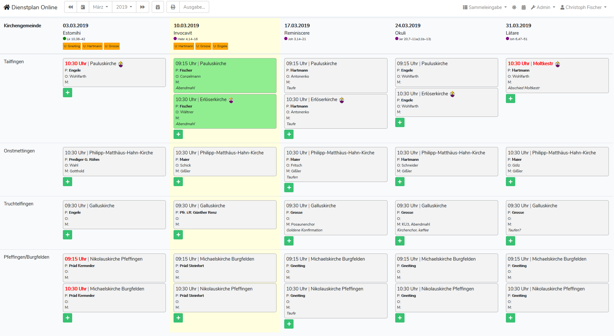

## Zur Übersicht zurückkehren

Solange Sie angemeldet sind, können Sie jederzeit durch einen Klick auf
das Logo "Dienstplan Online" oben links zu dieser Übersichtsseite
zurückkehren.

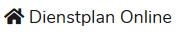

## Bereiche der Übersichtsseite

Die Übersichtsseite ist in zwei Hauptbereiche unterteilt: die
Werkzeugleiste und den Inhaltsbereich.

### Werkzeugleiste

Auf der Werkzeugleiste finden Sie die Ihnen zur Verfügung stehenden
Aktionen.

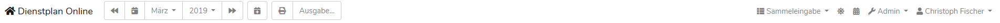

Von links nach rechts können Sie hier folgende Aktionen ausführen:

| Schaltfläche                                      | Aktion                                                                                                                                                                      |
|:--------------------------------------------------|:----------------------------------------------------------------------------------------------------------------------------------------------------------------------------|
|                  | Mit einem Klick auf das Logo "Dienstplan Online" kehren Sie zur Übersichtsseite zurück.                                                                                     |
|          | Den vorhergehenden Monat anzeigen                                                                                                                                           |
| 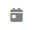                   | Zum aktuellen Monat gehen                                                                                                                                                   |
| 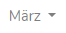                   | Ein Klick auf den Monatsnamen erlaubt Ihnen, direkt den angezeigten Monat auszuwählen.                                                                                      |
| 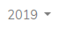                     | Ein Klick auf die Jahreszahl erlaubt Ihnen, direkt das angezeigte Jahr auszuwählen. Dabei werden nur Jahre angezeigt, in denen mindestens ein Monat bereits angelegt wurde. |
| 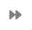         | Den nächsten Monat anzeigen                                                                                                                                                 |
| 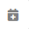               | [Einen neuen Tag im angezeigten Monat anlegen](#einen-tag-hinzufügen)                                                                                                       |
| 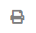       | Druckausgabe für den angezeigten Monat                                                                                                                                      |
| 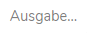 | [Vorhandene Daten in verschiedenen Formaten ausgeben](#ausgabemöglichkeiten)                                                                                                |
| 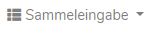                 | [Sammeleingabeformulare](#sammeleingaben) für verschiedene Felder anzeigen. Je nach [Benutzerrechten](#benutzerrechte) finden Sie hier unterschiedliche Möglichkeiten.      |
|              | Dienstplan online wird ständig weiterentwickelt. Ein Klick auf diese Schaltfläche zeigt Ihnen, welche Neuerungen zuletzt dazukamen.                                         |
|                | [Kalender zur Anzeige in Microsoft Outlook vorbereiten](#kalender-in-microsoft-outlook-einbinden)                                                                           |
| 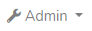                   | Je nach [Benutzerrechten](#benutzerrechte) können Sie hier verschiedene [Administratorfunktionen](#administration) aufrufen.                                                |
| 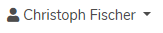                     | [Ändern Sie Ihr Passwort](#passwort-ändern) oder [melden Sie sich ab](#abmelden) .                                                                                          |

### Inhaltsbereich

Im unteren Bereich der Übersichtsseite finden Sie eine kalendarische
Übersicht aller relevanten Tage des angezeigten Monats. Die
Kirchengemeinden, für die Sie Leserechte haben, werden hier
untereinander angezeigt. In der jeweiligen Tagesspalte sehen Sie dann
die Gottesdienste, die für diesen Tag in dieser Kirchengemeinde geplant
sind.

Gottesdienste, für die Sie eingeteilt sind, erscheinen in der Übersicht
grün hinterlegt.

Die Spalte mit dem vom heutigen Datum aus gesehen nächsten Gottesdienst
ist gelb hinterlegt.

#### Informationen zum Tag

In der Überschriftszeile erscheinen für jeden Tag eine Reihe von
Informationen:

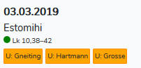

* Das Datum des jeweiligen Tages
* Die Bezeichnung des Feiertags oder eine Beschreibung (sofern
  vorhanden)
* Die liturgische Farbe (sofern bekannt)
* Der Predigttext zum Tag (sofern vorhanden)
* Die an diesem Tag abwesenden Pfarrer*innen

Die Anzeige der abwesenden Pfarrer\*innen erfolgt nur, wenn ein
[Urlaubskalender](#urlaubskalender-einrichten) eingerichtet ist und Sie
die notwendigen [Benutzerrechte](#benutzerrechte) zur Einteilung von
Pfarrer\*innen besitzen.

Wenn Sie den Mauszeiger über diese Informationen bewegen, erscheinen
(die zugehörigen [Benutzerrechte](#benutzerrechte) vorausgesetzt) die
Schaltflächen, mit denen Sie den Tag
[bearbeiten](#einen-bestehenden-tag-bearbeiten) oder
[löschen](#einen-angezeigten-tag-löschen) können:

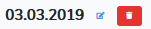

#### Informationen zum Gottesdienst

Zu jedem Gottesdienst werden folgende Informationen in der Übersicht
angezeigt:

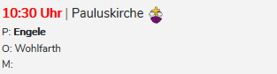

* Die Uhrzeit. Weicht die Uhrzeit von der Standarduhrzeit für die
  gewählte Kirche ab, erscheint sie rot.
* Die Kirche, in der der Gottesdienst stattfindet. Wenn es sich dabei um
  einen Freitexteintrag handelt, erscheint der Text rot.
* Der/die eingeteilte Pfarrer\*in (P:)
* Der/die eingeteilte Organist\*in (O:)
* Der/die eingeteilte Mesner\*in (M:)
* Das Symbol der Kinderkirche , sofern
  parallel ein Kindergottesdienst stattfindet. Halten Sie den Mauszeiger
  über diesem Symbol still, um weitere Informationen zur Kinderkirche zu
  sehen.

Wenn Sie selbst für den Gottesdienst eingeteilt sind, ist dieser Eintrag
grün hinterlegt.

Wenn Sie den Mauszeiger über den Gottesdiensteintrag bewegen, erscheint
dieser mit blauem Rand, wenn Sie die Benutzerrechte zum Bearbeiten des
Eintrags besitzen. In diesem Fall öffnen Sie durch einen Klick das
[Bearbeitungsformular](#einen-bestehenden-tag-bearbeiten).

#### Einen Tag hinzufügen

#### Einen bestehenden Tag bearbeiten

#### Einen angezeigten Tag löschen

Wenn ein Monat zum ersten Mal angezeigt wird, werden automatisch alle
Sonntage in diesem Monat angelegt.

# Gottesdienste anlegen und ändern

## Einen Gottesdienst hinzufügen

## Einen bestehenden Gottesdienst ändern

## Felder des Gottesdienstformulars

## Einen bestehenden Gottesdienst löschen

# Ausgabemöglichkeiten

## Druckansicht des angezeigten Monats

## Listen und Formulare ausgeben

## Kalender in Microsoft Outlook einbinden

# Sammeleingaben

# Öffentliche Seiten

# Administration

## Benutzerkonten

### Einen neuen Benutzer anlegen

### Einen vorhandenen Benutzer bearbeiten

### Einen vorhandenen Benutzer löschen

### Benutzerrechte

# Installation

## Konfiguration

### Urlaubskalender einrichten

